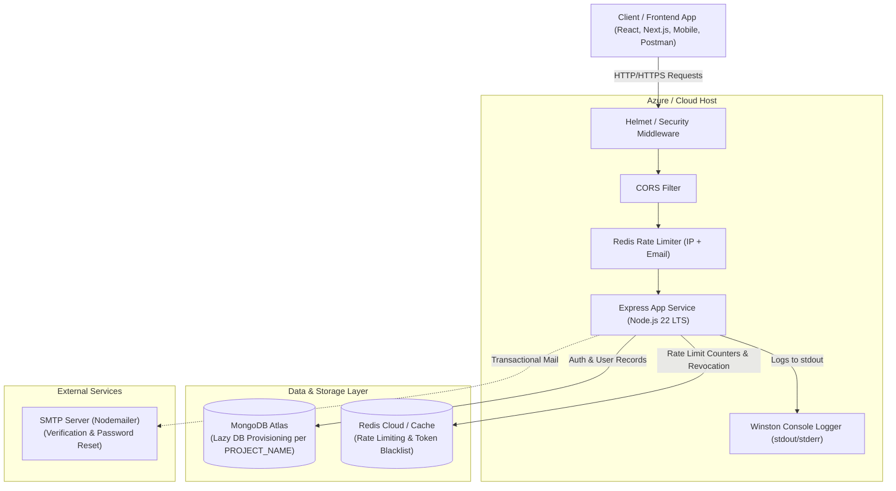
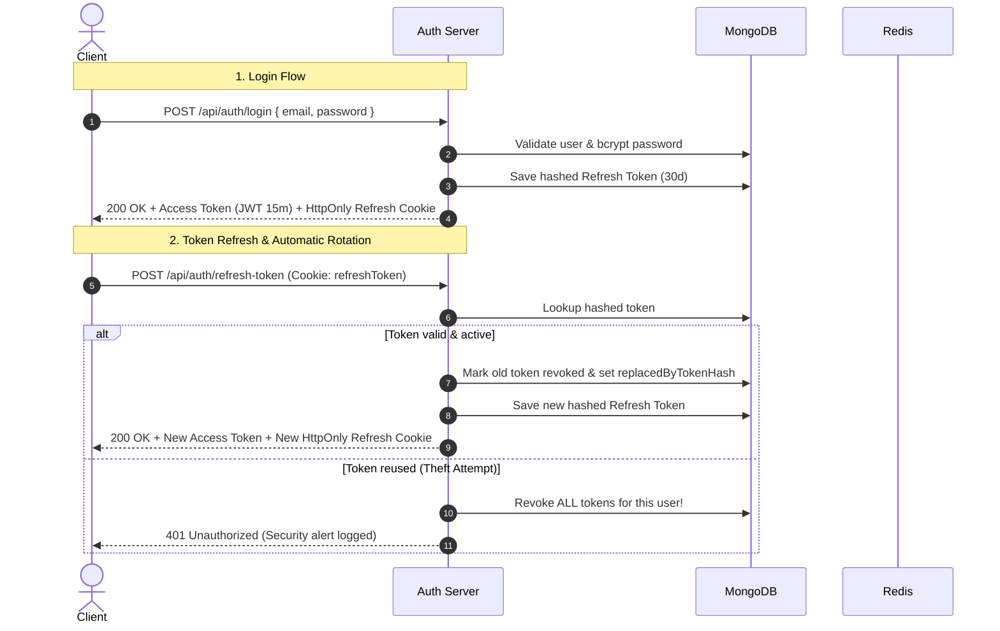

# Architecture & Technical Design Specification

> **Auth Microservice** — Production-Grade, Zero-Touch Reusable Authentication & Authorization Service  
> **Built with:** Node.js 22 LTS | Express | MongoDB Atlas | Redis | Winston

---

## 1. Executive Summary & Value Proposition

The **Auth Microservice** is a standalone, enterprise-ready authentication engine designed to be dropped into any software ecosystem without modifying application code. 

Instead of re-implementing authentication across different products, this service acts as a centralized identity provider driven entirely by environment configuration. Setting a single variable (`PROJECT_NAME`) automatically provisions isolated database namespaces in MongoDB Atlas and isolated Redis key prefixing, enabling multi-project reusability on shared database infrastructure.

---

## 2. System Architecture & Component Diagram

### High-Level System Architecture



---

## 3. Key Architectural Highlights

### 3.1. Zero-Touch Dynamic Database Provisioning
- **Mechanism**: On database connection (`src/config/db.js`), the microservice appends `process.env.PROJECT_NAME` to the MongoDB Atlas base connection URI.
- **Benefit**: MongoDB lazily provisions the database on the first write operation. Switching the service to power a new application only requires updating `PROJECT_NAME=new_project` in the environment variables without any manual Atlas cluster setup.

### 3.2. Dual-Token Authentication with Automatic Rotation & Reuse Theft Detection
- **Access Token**: Short-lived (default `15m`) stateless JWT passed via `Authorization: Bearer <token>` header for low-latency API access.
- **Refresh Token**: Long-lived (default `30d`) JWT stored in a secure `HttpOnly`, `SameSite=Strict` HTTP cookie.
- **Server-Side Token Hash Storage**: Only the SHA-256 hash of the refresh token is stored in MongoDB (`RefreshToken` model).
- **Token Family & Theft Detection**: Every refresh token exchange generates a new token pair and revokes the old refresh token (`replacedByTokenHash`). If an attacker attempts to reuse a previously rotated refresh token, the system detects the anomaly and **immediately revokes all refresh tokens for that user family**, forcing a complete re-authentication.



### 3.3. Multi-Tiered Rate Limiting & Abuse Defense
- **Login Rate Limiter** (`RateLimiterRedis`): Keyed by `IP + Email` combination. Prevents credential stuffing attacks targeting a single account across distributed botnet IPs or single IP brute-forcing.
- **Global API Limiter**: Keyed per IP to guard against overall DoS attacks.
- **Sensitive Flow Limiter**: Strict limits on email-triggering endpoints (password reset, email verification resend) to prevent email bombing.

### 3.4. Cryptographic Security Standards
- **Password Security**: Hashed using `bcryptjs` with a cost factor of `12`. Passwords are excluded by default in Mongoose queries (`select: false`).
- **Token Hashing**: Email verification tokens and password reset tokens are stored as **one-way SHA-256 hashes** in the database. Even if the database is leaked, raw reset tokens cannot be extracted.
- **Password Change Invalidation**: The `User` schema tracks `passwordChangedAt`. Any access token issued prior to the password change timestamp is automatically rejected by the `protect` middleware.

### 3.5. Cloud-Native 12-Factor Logging
- Integrated with `Winston` configured strictly for standard output (`Console` / `stdout`).
- Local log file writing (`.log`) is eliminated to preserve disk storage on Azure App Service / Container instances.
- Cloud log aggregators (Azure Monitor / Application Insights / Log Analytics) automatically capture `stdout` logs.

---

## 4. Directory Blueprint & Module Roles

```text
auth-microservice/
├── Dockerfile                  # Container definition (Node 22 Alpine)
├── docker-compose.yml          # Local container orchestration with Redis
├── package.json                # Dependencies & Node engine specification (>=22.0.0)
├── server.js                   # Application entrypoint & graceful shutdown handlers
└── src/
    ├── app.js                  # Express setup, security middleware, & routing
    ├── config/
    │   ├── db.js               # Dynamic MongoDB Atlas connection & database selection
    │   └── redis.js            # Redis client instantiation & namespace configuration
    ├── controllers/
    │   └── authController.js   # Main authentication, token, & account business logic
    ├── middleware/
    │   ├── auth.js             # JWT verification & Role-Based Access Control (RBAC)
    │   ├── errorHandler.js     # Global error handling & stack sanitization
    │   └── rateLimiter.js      # Redis-backed rate limiting middleware
    ├── models/
    │   ├── User.js             # User schema, password hashing hooks, & token generators
    │   └── RefreshToken.js     # Refresh token schema with TTL auto-deletion index
    ├── routes/
    │   └── authRoutes.js       # Express route declarations & input validation hooks
    ├── utils/
    │   ├── AppError.js         # Operational custom error class
    │   ├── catchAsync.js       # Asynchronous error wrapper
    │   ├── logger.js           # Winston logger instance (Console stream)
    │   ├── seedAdmin.js        # Script to bootstrap default administrator
    │   ├── sendEmail.js        # Nodemailer email transport abstraction
    │   └── tokens.js           # JWT signing/verification & token hashing utilities
    └── validators/
        └── authValidators.js   # Express-validator input sanitization rules
```

---

## 5. Security & Vulnerability Matrix

| Threat Vector | Mitigation Layer | Implementation Details |
| :--- | :--- | :--- |
| **NoSQL Injection** | `express-mongo-sanitize` | Strips `$` and `.` operators from request bodies, parameters, and query strings. |
| **Cross-Site Scripting (XSS)** | `xss-clean` + `HttpOnly` Cookies | Sanitizes malicious HTML/JS in user input; stores refresh tokens in non-javascript-accessible cookies. |
| **HTTP Parameter Pollution** | `hpp` | Prevents HTTP parameter manipulation in query strings. |
| **Security Headers** | `helmet` | Sets HTTP headers (`X-Frame-Options`, `X-Content-Type-Options`, `CSP`, etc.). |
| **Credential Stuffing** | `RateLimiterRedis` | Throttles login requests per IP + Email address. |
| **Stale JWT Misuse** | `passwordChangedAt` check | Invalidates tokens generated before password updates. |
| **Database TTL Cleanup** | MongoDB TTL Index | Automatically purges expired refresh tokens (`expiresAt`) to keep DB size lean. |

---

## 6. Complete API Endpoint Specification

All endpoints are prefixed with `/api/auth`:

| Method | Endpoint | Access | Description |
| :--- | :--- | :--- | :--- |
| `POST` | `/api/auth/register` | Public | Register a new account & receive tokens |
| `POST` | `/api/auth/login` | Public | Authenticate user & issue token pair |
| `POST` | `/api/auth/logout` | Public | Revoke refresh token & clear cookie |
| `POST` | `/api/auth/refresh-token` | Public | Exchange refresh cookie for new Access Token |
| `GET`  | `/api/auth/me` | Protected | Fetch current user's profile details |
| `POST` | `/api/auth/verify-email` | Public | Verify email via token |
| `POST` | `/api/auth/resend-verification` | Public | Request new verification email link |
| `POST` | `/api/auth/forgot-password` | Public | Request password reset token |
| `POST` | `/api/auth/reset-password` | Public | Reset password using valid token |
| `PATCH`| `/api/auth/update-password` | Protected | Update password for logged-in user |
| `POST` | `/api/auth/logout-all` | Protected | Revoke all active sessions across all devices |

---

## 7. Cloud Deployment Checklist (Azure / Production)

- [x] **Node Runtime**: Set to Node 22 LTS in Dockerfile (`node:22-alpine`) and `package.json` (`>=22.0.0`).
- [x] **Log Management**: Configured for `stdout` stream (compatible with Azure Log Analytics).
- [ ] **Environment Variables**: Configure in Azure Portal App Service Settings:
  - `NODE_ENV=production`
  - `MONGO_URI=mongodb+srv://...`
  - `REDIS_URI=rediss://...`
  - `PROJECT_NAME=your_project_name`
  - `JWT_ACCESS_SECRET` & `JWT_REFRESH_SECRET`
- [ ] **Startup Command**: Set to `node server.js` in Azure App Service Configuration.
